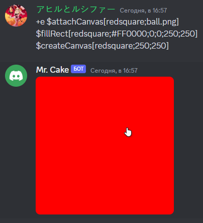

Draws a new rect.
## Usage
```
$fillRect[canvas;color;x?;y?;width;height;radius?]
```

## Parameters
| Field | Description | Type | Required |
| --- | --- | --- | --- |
| canvas | The canvas name. | string | true |
| color | The rect color. | color | true |
| x | The rect X position. | number | false |
| y | The rect Y position. | number | false |
| width | The rect width. | number | true |
| height | The rect height. | number | true |
| radius | The rect corners radius. | number | false |

## Example(s)

### This will draw a 250x250 red square

```
$attachCanvas[redsquare;ball.png]
$fillRect[redsquare;#FF0000;0;0;250;250]
$createCanvas[redsquare;250;250]
```



### This will draw a 250x250 red circle

```
$attachCanvas[redball;ball.png]
$fillRect[redball;#FF0000;0;0;250;250;125]
$createCanvas[redball;250;250]
```

